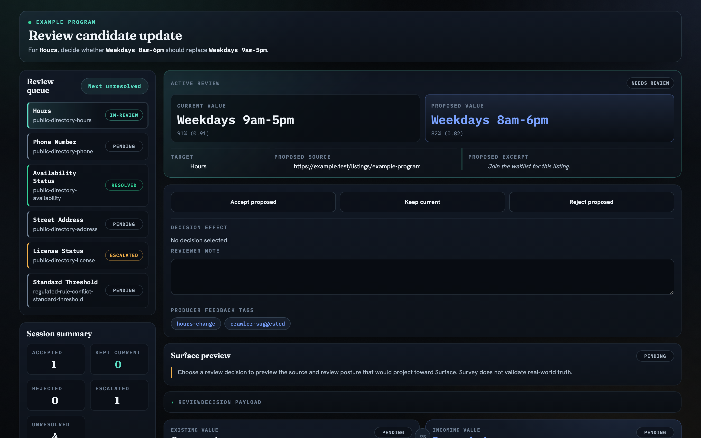

<div align="center">

# Kontour Survey

**The producer side of trust. Survey carries evidence from raw source to reviewed claim — without ever pretending to know what's true.**

[](https://www.npmjs.com/package/@kontourai/survey)
[](https://github.com/kontourai/survey/actions/workflows/ci.yml)
[](LICENSE)

[Documentation](https://kontourai.github.io/survey/) · [Record Contracts](docs/record-contracts.md) · [Consumer Guide](docs/consumer-integration-guide.md) · [kontourai.io/survey](https://kontourai.io/survey)

</div>

---

Every "verified" value in a data product has a story: where it was observed, what was extracted, what the alternatives were, who reviewed it, and what they decided. Most systems throw that story away the moment a human clicks approve — leaving a bare value nobody can re-inspect.

Survey is the contract that keeps the story. Producers own acquisition, parsing, ranking, review UX, and vertical policy; Survey owns the portable record shapes for the **source → extraction → candidate → review → claim** chain, and projects them into [Surface](https://kontourai.io/surface) Trust Bundles — so downstream trust reports, consoles, and [Flow](https://kontourai.github.io/flow/) gates can see not just the value, but the evidence and the review posture behind it.

Survey does not decide whether a real-world value is true. It preserves the producer's evidence and review discipline so something downstream can.

## What you get

- **Typed record contracts** for raw sources, extractions, candidates, review outcomes, source-of-authority posture, repeated observations, resolutions, review proofs, and adversarial passes — every link in the evidence chain inspectable after the fact.
- **One projection to Surface.** `buildSurveyTrustBundle` turns Survey records into a Surface Trust Bundle; Surface owns claims, evidence, status, and trust reporting from there.
- **An embeddable Review Workbench** — a framework-neutral UI for working a `ReviewItem` queue: current vs proposed values, source refs and excerpts, decision controls, and a live Surface preview.
- **A server-owned apply boundary.** Review decisions are derived from pre-decision snapshots plus persisted events — never from browser-computed payloads — with freshness and replay checks built in.
- **Adversarial-pass records** for high-stakes review loops, designed to serve as per-round evidence for [Flow's adversarial route-back pattern](https://kontourai.github.io/flow/gates-and-route-back.html#pattern-adversarial-review-with-a-defect-budget).

## See it

The Review Workbench rendering a real example queue — current vs proposed values, source evidence, decision effect, and the Surface projection preview:



## Quickstart

```sh
npm install @kontourai/survey @kontourai/surface
```

```ts
import { buildTrustReport, validateTrustBundle } from "@kontourai/surface";
import { buildSurveyTrustBundle, SurveyInputBuilder } from "@kontourai/survey";

const surveyInput = new SurveyInputBuilder({
  source: "example-producer:run-1",
})
  .addObservation({
    id: "listing-123.availability.current",
    rawSource: {
      kind: "web-page",
      sourceRef: "https://example.test/listings/123",
      observedAt: new Date().toISOString(),
      locatorScheme: "html",
    },
    extraction: {
      target: "availabilityStatus",
      value: "AVAILABLE",
      confidence: 0.92,
      locator: "html:field=availabilityStatus",
      excerpt: "Availability is open.",
      extractor: "example-crawler",
      extractedAt: new Date().toISOString(),
    },
    reviewOutcome: {
      status: "verified",
      actor: "example-operator",
      reviewedAt: new Date().toISOString(),
    },
    claim: {
      subjectType: "public-record.entity",
      subjectId: "listing-123",
      surface: "public-record.profile",
      claimType: "public-data.field",
      fieldOrBehavior: "availabilityStatus",
      impactLevel: "medium",
      collectedBy: "example-crawler",
    },
  })
  .build();

const trustBundle = validateTrustBundle(buildSurveyTrustBundle(surveyInput));
const report = buildTrustReport(trustBundle);
```

One observation, one chain: the page it came from, what the extractor read, who verified it, and the claim it supports — projected into a Surface trust report with the evidence attached.

## The producer validation path

1. Build Survey observations covering each link in the evidence chain.
2. Call `buildSurveyTrustBundle` to project the Survey records into a Surface Trust Bundle.
3. Call Surface `validateTrustBundle` on the Trust Bundle.
4. Optionally call public Surface report APIs such as `buildTrustReport` to inspect claims, evidence, status, gaps, and metadata.

Keep producer operational state outside Survey. Queue status, reviewer form state, retries, source caches, and product policy decisions belong in the producer's own data model. Survey carries only the portable evidence chain records needed by Surface.

When you build an `authorized-action` authorizing block outside the workbench, pair `buildAuthorizedActionAuthorizing` with `buildPromptRef({ module, component, version?, scheme? })` — `buildPromptRef` formats a well-formed, versioned `promptRef` (bare `"review-workbench/decision-card@v1"` or scheme-prefixed `"survey://<module>/<component>@v1"`) that `buildAuthorizedActionAuthorizing` accepts directly, instead of hand-formatting the string.

## Review Workbench embed

**Web component** (shadow DOM, no framework required):

```html
<link rel="stylesheet" href="@kontourai/survey/review-workbench/standalone.css">
<survey-review-workbench theme="survey" color-scheme="dark"></survey-review-workbench>
<script type="module">
  import "@kontourai/survey/review-workbench/element";
  const el = document.querySelector("survey-review-workbench");
  el.session = reviewQueueSession;
  el.presentationAdapter = myAdapter;
</script>
```

**Direct mount** into an existing element:

```ts
import {
  mountReviewWorkbench,
  type ReviewPresentationAdapter,
} from "@kontourai/survey/review-workbench";
import "@kontourai/survey/review-workbench.css";

const presentationAdapter = {
  labelForTarget: (target) => target === "registrationStatus"
    ? "Registration status"
    : undefined,
  linkForReviewItem: (item) => ({ href: `/review/${item.metadata.name}` }),
} satisfies ReviewPresentationAdapter;

mountReviewWorkbench(element, reviewQueueSession, { presentationAdapter });
```

The embedded stylesheet is scoped to `.survey-workbench-embed` and bundles Console Kit tokens, so it will not rewrite the host application's `body` or `:root` styles. Mount into:

```html
<div class="survey-workbench-embed theme-survey"></div>
```

`@kontourai/survey/review-workbench/standalone.css` exists for pages Survey owns entirely.

## Review MCP

Drive review-queue decisions from an MCP agent (Claude Desktop, Cursor, or any MCP host):

```sh
npx survey-review-mcp --session path/to/session.json
```

Three tools: `survey_review_queue` (queue state), `survey_review_item` (item detail), and `survey_review_decide` (record a decision). Each queue and item call includes an embedded, fully self-contained review card with Accept / Hold / Reject buttons. See [docs/review-mcp.md](docs/review-mcp.md).

At viewports ≤ 980 px, the queue panel becomes a slide-in drawer with a compact progress bar. At narrow container widths, `cqi`-based type scaling keeps candidate values from overflowing at 360 px. CSS custom properties (`--k-*`) inherit through the shadow boundary so the host can theme either mode without forking styles.

Server code persisting browser-submitted review events should use `persistReviewSessionEvents`, then `deriveReviewSessionApplyResultForSnapshot` (or the composed `deriveServerReviewSessionApplyResult` from `@kontourai/survey/review-workbench/server-review-session`) before applying product policy — write results derive from pre-decision snapshots plus persisted events, never from browser-computed decisions.

The [Consumer Integration Guide](docs/consumer-integration-guide.md) covers the full path from `ReviewItem` construction through persisted review events, exported results, Surface projection, and the full `--k-*` theming token list. Test-covered examples are under [`examples/review-workbench/`](examples/review-workbench/). To run the standalone demo locally, see [Review Workbench Prototype](docs/review-workbench-prototype.md).


## Standalone review console

Spawn a loopback browser dashboard backed directly by a session file:

```sh
npx survey-review-console --session path/to/session.json [--port 4243]
```

Opens the full Review Workbench in your browser. Every decision you make is persisted back to the session file atomically via the same `deriveServerReviewSessionApplyResult` validation the MCP server uses. An SSE stream watches the file for changes, so the browser and any concurrent MCP agent converge live on the same event queue — no page refresh required. See [docs/review-console.md](docs/review-console.md).

## Where Survey fits

Kontour AI shows the work behind AI. Survey is the producer-side primitive:

| Product | Owns |
| --- | --- |
| **Survey** | Producer evidence: source → extraction → candidate → review → claim |
| **[Surface](https://kontourai.io/surface)** | Portable trust state: claims, evidence, policies, trust snapshots |
| **[Flow](https://kontourai.io/flow)** | Process transparency: steps, gates, transitions, runs, exceptions |
| **[Veritas](https://kontourai.io/veritas)** | Code/change transparency: repo standards, merge readiness |
| **[Flow Agents](https://kontourai.io/flow-agents)** | Agent-facing distribution: skills, kits, runtime adapters, hooks |

Survey feeds Surface; Surface-shaped evidence feeds Flow gates; Flow's adversarial route-back pattern consumes Survey's per-round adversarial-pass records. Each product stands alone — Survey only requires `@kontourai/surface`.

## Documentation

| Guide | What it covers |
| --- | --- |
| [Record Contracts](docs/record-contracts.md) | every record shape in the chain: raw sources, extractions, candidates, reviews, proofs, resolutions, comfort-zone flags |
| [Adversarial Passes & Learning](docs/adversarial-and-learning.md) | per-round adversarial review records and learning projections, and the Flow boundary |
| [Consumer Integration Guide](docs/consumer-integration-guide.md) | the full consumer path: ReviewItem queues, the workbench, persisted events, the server apply boundary |
| [Review Resource Contract](docs/review-resource-contract.md) | the Kontour Resource shapes for review sessions and events |
| [Source-Authority Review Pattern](docs/source-authority-review-pattern.md) | record discipline for sources the producer treats as authoritative |
| [Review Workbench Prototype](docs/review-workbench-prototype.md) | running the example-backed standalone demo locally |
| [Review Console](docs/review-console.md) | standalone local dashboard: browser + MCP agent share the session file |
| [Review MCP](docs/review-mcp.md) | MCP server for agent-driven review-queue decisions |
| [Releasing](docs/RELEASING.md) | release prep and publish flow |

## Product boundary

Survey does not crawl pages, parse PDFs, rank candidates, decide review policy, or claim a value is true. Producers own acquisition, extraction, ranking, review UX, materiality, and domain policy. Survey gives those producers a consistent evidence chain contract before the records enter Surface.

## Contributor checks

Install the repo-owned Git hooks once per clone:

```bash
npm run setup:repo-hooks
```

The setup command is idempotent. It sets this repo's local `core.hooksPath` to `.githooks` and does not require global Git configuration. Validate hook drift or package health directly:

```bash
npm run validate:repo-hooks
npm run verify
```

The committed pre-push hook runs both commands from the repo root.

## License

[Apache-2.0](LICENSE) © Kontour AI
